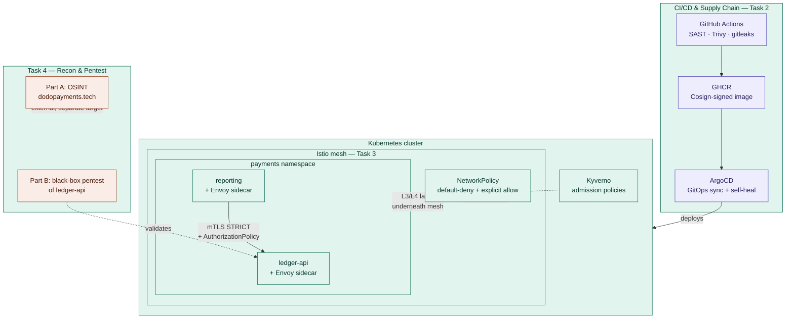

# Dodo Payments — DevSecOps Assessment Submission

**Candidate:** Sajid Shaikh
**Assessment:** Security & DevOps Engineer — Technical Assessment (Dodo Payments)

This repository contains all four tasks of the assessment: hardening `ledger-api` end to end, building a secure CI/CD supply chain, enforcing zero-trust networking with Istio, and reconnaissance + penetration testing.

---

## Approach

The starting point was `ledger-api` — a payments microservice deployed with plaintext secrets, a root container, and no network policy. The work across all four tasks follows one thread: assume the workload is compromised or the network is hostile at every layer, and make sure no single control is load-bearing on its own.

- **Task 1** removes the obvious weaknesses at the workload level — root containers, missing resource limits, plaintext secrets, no admission control.
- **Task 2** moves security left into the delivery pipeline itself, so a bad commit can't reach the cluster without passing through scanning, signing, and GitOps-managed deployment.
- **Task 3** assumes the network is hostile even *inside* the cluster — mTLS and identity-based authorization mean a compromised neighbor pod still can't talk to `ledger-api` without being explicitly allowed.
- **Task 4** switches to the attacker's perspective — both externally (OSINT against `dodopayments.tech`) and internally (black-box pentest of `ledger-api` itself), to verify the earlier controls actually hold up and to find what they missed.

Findings from Task 4 are explicitly cross-referenced back to which Task 1–3 controls would (or wouldn't) have caught them — see `task4-recon-pentest/task4-report.md`.

---

## Architecture

**Reading the diagram:** code lands in GHCR only after passing security gates, ArgoCD is the only thing that ever touches the cluster (no manual `kubectl apply` in the delivery path), Kyverno gates what's allowed to run at all, and inside the mesh every service-to-service call is both encrypted (mTLS) and explicitly authorized by identity — with a plain Kubernetes NetworkPolicy underneath as a second, independent layer in case the mesh layer is ever bypassed or misconfigured. Task 4 sits outside this flow deliberately — Part A never touches this infrastructure at all (separate, real, external domain), and Part B's active testing targets only the `ledger-api` application logic directly, not the cluster it runs in.

---

## Task Index

| Task | Summary | Link |
|---|---|---|
| 1 — Workload Hardening | Non-root, read-only rootfs, dropped capabilities, seccomp, resource limits, least-privilege ServiceAccount + RBAC, Sealed Secrets, Kyverno admission policies | [`k8s/`](./k8s), [`argocd/`](./argocd) |
| 2 — Secure CI/CD & Supply Chain | GitHub Actions pipeline with SAST/CVE/secrets scanning gates, Cosign keyless signing, SLSA-style attestation, ArgoCD GitOps with drift detection | [`.github/workflows/`](./.github/workflows), [`app/SECURITY-FIXES.md`](./app/SECURITY-FIXES.md) |
| 3 — Service Mesh & Zero-Trust (Istio) | mTLS STRICT, identity-based AuthorizationPolicy, defense-in-depth NetworkPolicy, full working evidence | [`task3-istio/README.md`](./task3-istio/README.md) |
| 4 — Recon & Penetration Testing | Part A: passive OSINT on dodopayments.tech. Part B: authorized black-box pentest of ledger-api, with retests and findings chained back to Tasks 1–3 | [`task4-recon-pentest/README.md`](./task4-recon-pentest/README.md), [`task4-recon-pentest/task4-report.md`](./task4-recon-pentest/task4-report.md) |

---

## Application Overview — ledger-api

Payments microservice for tokenising PANs and serving transaction metadata. Deployed on Kubernetes in the `payments` namespace.

| Method | Path | Description |
|---|---|---|
| GET | `/health` | Liveness check |
| POST | `/tokenize` | `{"pan": "..."}` → opaque token |
| GET | `/transactions` | Recent transaction records |
| POST | `/import` | Import a YAML configuration blob |
| GET | `/fetch?url=` | Fetch a remote resource by URL |

Further application-security notes (fixes applied during Task 2's review) are in [`app/SECURITY-FIXES.md`](./app/SECURITY-FIXES.md).

---

## What I'd Do With More Time

- Close Findings 1 and 2 from Task 4 (unauthenticated PAN exposure, deterministic tokenization) in code, with a retest section added the same way R1/R2 were closed.
- Confirm the SSRF-via-redirect finding conclusively against a stable self-hosted redirect target rather than the flaky third-party httpbin.org.
- Add `169.254.0.0/16` and `127.0.0.0/8` to the Task 3 NetworkPolicy egress exception list (gap identified while writing Task 4).
- Complete the Task 3 bonus items (Istio Ingress Gateway with TLS termination, canary release via VirtualService/DestinationRule).
- Run the full Part A tool sweep (subfinder/amass/httpx/testssl/crt.sh) a second time and diff against the first pass to check for infrastructure drift over the assessment window.
