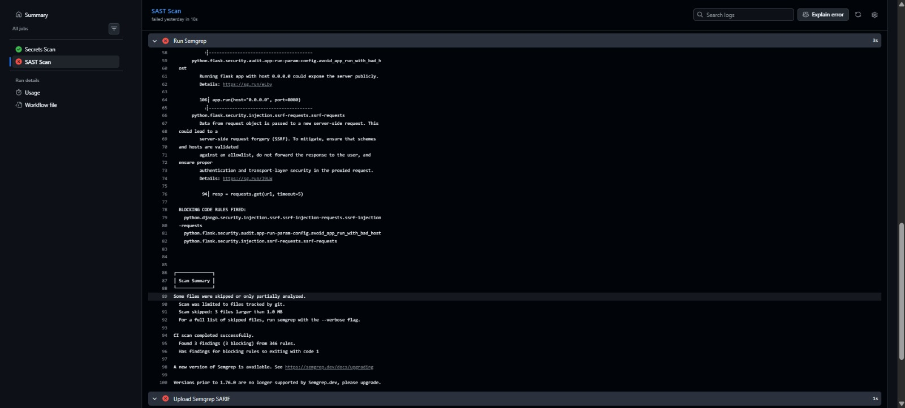
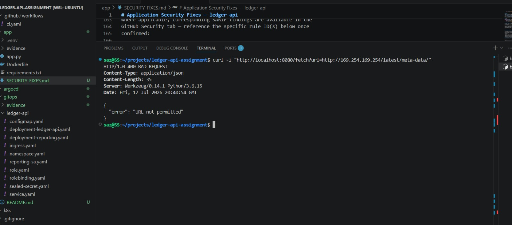

# Application Security Fixes — ledger-api

This document records vulnerabilities identified in `app/app.py` during an
Application Security Review (SAST scanning plus manual code review) and the
remediation applied to each. This complements Task 2 (fail-policy
documentation) and Task 4 (findings → remediation → retest) of the
assignment.

---

## Finding 1 — Server-Side Request Forgery (SSRF) in `/fetch`

**CVSS v3.1:** 8.1 (High)
**Vector:** `AV:N/AC:L/PR:N/UI:N/S:U/C:H/I:L/A:N`
**CWE:** CWE-918 (Server-Side Request Forgery)
**Location:** `app/app.py`, `/fetch` route

### Before
```python
@app.route("/fetch")
def fetch():
    url = request.args.get("url", "")
    resp = requests.get(url, timeout=5)
    return jsonify(status_code=resp.status_code, body=resp.text[:2048])
```

### Issue
The `url` query parameter was passed directly to `requests.get()` with no
validation. An attacker could supply:
- Internal/private IPs or hostnames (`http://169.254.169.254/latest/meta-data/`,
  `http://localhost:6379`, `http://10.0.0.5:8080/admin`) to reach internal
  services, cloud metadata endpoints, or other pods in the cluster that are
  not otherwise exposed externally.
- Non-HTTP schemes (`file://`, `gopher://`) depending on the underlying
  `requests`/`urllib3` behavior, to attempt local file reads or protocol
  smuggling.

In a PCI-scoped environment, an SSRF here is particularly dangerous because it
could be used to pivot from this externally-reachable service into the
cardholder-data-environment (CDE) — exactly the kind of finding this
assessment's Task 3 (zero-trust networking) and Task 4 (pentest) are designed
to catch.

### Fix
```python
import ipaddress
import socket
from urllib.parse import urlparse

ALLOWED_FETCH_HOSTS = {
    "httpbin.org",
    "example.com",
}

def is_safe_url(url: str) -> bool:
    try:
        parsed = urlparse(url)
    except Exception:
        return False

    if parsed.scheme not in ("http", "https"):
        return False

    if parsed.hostname not in ALLOWED_FETCH_HOSTS:
        return False

    try:
        resolved_ip = socket.gethostbyname(parsed.hostname)
        if ipaddress.ip_address(resolved_ip).is_private:
            return False
    except Exception:
        return False

    return True


@app.route("/fetch")
def fetch():
    url = request.args.get("url", "")

    if not is_safe_url(url):
        return jsonify(error="URL not permitted"), 400

    resp = requests.get(url, timeout=5)
    return jsonify(status_code=resp.status_code, body=resp.text[:2048])
```

### Why this fix, and its limits
- **Scheme allowlist** — blocks `file://`, `gopher://`, and other
  non-HTTP(S) schemes outright.
- **Host allowlist** — restricts outbound requests to a fixed, known set of
  trusted domains rather than trying to blocklist "bad" hosts (blocklists are
  bypassable; allowlists are not).
- **DNS resolution + private-IP check** — defends against DNS rebinding,
  where an allowlisted hostname is made to resolve to a private/internal IP
  at request time rather than at validation time.
- **Known limitation:** this check resolves the hostname once for
  validation; a sufficiently fast DNS-rebinding attack could theoretically
  swap the IP between validation and the actual `requests.get()` call
  (TOCTOU). For production, the safer fix is to disable this endpoint
  entirely unless outbound fetch is a genuine product requirement, or to
  route it through an explicit egress proxy with its own allowlist enforced
  at the network layer (this is one of the things Task 3's NetworkPolicy /
  Istio egress controls are positioned to catch as defense-in-depth).

Application-level validation alone is not sufficient — it can be bypassed by
a bug in the allowlist logic, a future code change, or a TOCTOU race as
noted above. Task 3 further restricts outbound communication using Istio
`AuthorizationPolicy` and Kubernetes `NetworkPolicy`, so even if this
in-app check were ever bypassed, the workload's network identity would
still be denied egress to unapproved destinations — defense in depth
rather than a single point of failure.

---

## Finding 2 — Unsafe YAML Deserialization in `/import`

**CVSS v3.1:** 9.8 (Critical)
**Vector:** `AV:N/AC:L/PR:N/UI:N/S:U/C:H/I:H/A:H`
**CWE:** CWE-502 (Deserialization of Untrusted Data)
**Location:** `app/app.py`, `/import` route

### Before
```python
@app.route("/import", methods=["POST"])
def import_config():
    config = yaml.load(request.data)
    return jsonify(loaded=str(config))
```

### Issue
`yaml.load()` without an explicit `Loader` argument uses PyYAML's full
loader by default in older PyYAML versions, which can deserialize arbitrary
Python objects — including calls to `os.system` or similar — via YAML tags
like `!!python/object/apply`. This is a well-known remote code execution
vector: an attacker POSTing a crafted YAML payload to `/import` could
potentially execute arbitrary code in the container.

### Fix
```python
@app.route("/import", methods=["POST"])
def import_config():
    config = yaml.safe_load(request.data)
    return jsonify(loaded=str(config))
```

`yaml.safe_load()` restricts deserialization to basic Python types (str,
int, list, dict, etc.) and refuses to construct arbitrary objects, closing
off the RCE path entirely while preserving the endpoint's intended
functionality.

The fix was committed and verified by rerunning the GitHub Actions
pipeline: Semgrep and Trivy completed successfully before the change was
merged, and the corrected image was rebuilt, signed, and re-deployed
through the same GitOps pipeline described in Task 2.

---

## How these were found

The findings were identified through a combination of Semgrep SAST
scanning and manual code review during the Application Security Review.
Where applicable, corresponding SARIF findings are available in the
GitHub Security tab — reference the specific rule ID(s) below once
confirmed:

- Semgrep rule(s) triggered: `<fill in from Security tab, e.g.
  python.lang.security.audit.dangerous-subprocess-use / yaml.load>`
- Manual review: confirmed the SSRF path and unsafe deserialization by
  direct code inspection of `app/app.py`.

## Verification / retest

After deploying the fix, confirm:

```bash
# SSRF — should now be rejected
curl "http://<ledger-api-host>/fetch?url=http://169.254.169.254/latest/meta-data/"
# Expect: 400 {"error": "URL not permitted"}

# SSRF — allowed host should still work
curl "http://<ledger-api-host>/fetch?url=http://example.com"
# Expect: 200 with response body

# YAML — arbitrary object construction should now fail safely
curl -X POST http://<ledger-api-host>/import \
  --data '!!python/object/apply:os.system ["id"]'
# Expect: safe_load raises a constructor error / returns a safe error response,
# not command execution
```

---

## Screenshots

Add evidence below. Suggested filenames if placing images alongside this
file (e.g. in `k8s/evidence/` or a new `app/evidence/` folder):

| Evidence | Suggested filename | What to capture |
|---|---|---|
| Semgrep finding (before fix) | `semgrep-ssrf-finding.png` | Security tab / SARIF entry showing the SSRF or `yaml.load` rule firing |
| SSRF blocked (after fix) | `ssrf-blocked.png` | Terminal output of the `curl` metadata-endpoint test returning `400` |
| SSRF allowed host still works | `ssrf-allowed-host.png` | Terminal output of the allowlisted-host `curl` test returning `200` |
| YAML RCE payload rejected | `yaml-safe-load-rejected.png` | Terminal output of the crafted YAML POST failing safely |
| CI pipeline green after fix | `ci-pipeline-post-fix.png` | GitHub Actions run showing Semgrep/Trivy passing after the commit |

Markdown snippet to embed each once added:
```markdown


```

---

## Where this file lives

Place this as `app/SECURITY-FIXES.md` (next to `app.py`) since it documents
an application-code fix, not an infrastructure change — keeping it separate
from `k8s/README.md` (Task 1 hardening) and the Task 2 CI/GitOps README.
Link to it from your top-level `README.md`:

```markdown
- [Application security fixes](./app/SECURITY-FIXES.md) — SSRF and unsafe
  YAML deserialization findings and remediation.
```
