# Task 2 — Secure CI/CD Pipeline & Supply Chain

This document covers the delivery pipeline for `ledger-api`: build, scan,
sign, attest, and deploy via GitOps — plus the ArgoCD setup that makes Git
the single source of truth for what runs in the cluster.

Pipeline definition: [`.github/workflows/ci.yaml`](../.github/workflows/ci.yaml)
ArgoCD Application: [`argocd/application.yaml`](../argocd/application.yaml)
Live manifests (source of truth): [`gitops/ledger-api/`](../gitops/ledger-api/)

---

## 1. Pipeline architecture

```
push to main (excluding gitops/**)
        │
        ▼
  Gitleaks (secrets scan)  ──── hard block
        │
        ▼
  Semgrep (SAST)            ──── warn only (see fail policy below)
        │
        ▼
  Docker build + push to GHCR
        │
        ├─ tagged with full commit SHA (never :latest)
        ├─ provenance/SBOM manifest disabled (avoids broken multi-arch pulls)
        │
        ▼
  Trivy image scan (CRITICAL/HIGH) ──── warn only, SARIF uploaded
        │
        ▼
  Verify image is pullable          ──── hard block (fails fast if push was broken)
        │
        ▼
  Cosign keyless sign (by digest, not tag)
        │
        ▼
  SLSA provenance attestation (by digest)
        │
        ▼
  Update GitOps manifest — bot commits new SHA into
  gitops/ledger-api/deployment-ledger-api.yaml  [skip ci / path-ignored]
        │
        ▼
  ArgoCD detects Git change → auto-sync → self-heal
        │
        ▼
  Kubernetes (payments namespace)
```

Every image is:
- Built once, tagged immutably by commit SHA (no `:latest` deploys — this
  also keeps it compatible with the Task 1 Kyverno `disallow-latest-tag`
  policy).
- Signed and attested **by digest**, not by tag, so the signature can't be
  invalidated by a tag being repointed later.
- Verified pullable inside CI itself before signing — this is a deliberate
  gate added after an earlier incident where a broken multi-arch manifest
  passed CI but failed to pull in the cluster (`ImagePullBackOff`). Failing
  fast here means a broken image never reaches the signing/attestation
  stage or GitOps.

---

## 2. Gate fail policy

| Gate | Trigger | Policy | Rationale |
|---|---|---|---|
| **Gitleaks** (secrets) | Any regex match for keys/tokens/credentials | **Hard block** — no exceptions | A leaked credential is a binary bad outcome; there is no acceptable severity tier for a live secret in git history. False positives (e.g. SealedSecret ciphertext) are handled via a reviewed `.gitleaks.toml` allowlist entry, never a blanket suppression. |
| **Semgrep** (SAST) | `p/security-audit`, `p/python`, `p/flask` rulesets | **Warn only** during this assignment | The target application (`ledger-api-assignment`) intentionally contains seeded vulnerabilities for Task 4's Application Security Review / pentest. Hard-blocking would make the pipeline permanently red and prevent completing the rest of the assignment. **Production policy:** block on ERROR-severity findings (SQLi, hardcoded credentials, SSRF sinks); warn-only on WARNING/INFO (style, minor hygiene). |
| **Trivy** (CVE / image scan) | CRITICAL/HIGH severity, `ignore-unfixed: true` | **Warn only**, results surfaced via SARIF in the Security tab | `ignore-unfixed: true` already excludes CVEs with no available patch from failing criteria — the pipeline doesn't block on things that cannot currently be fixed. For a CRITICAL/HIGH CVE that *does* have a fix available but isn't taken immediately (e.g. pending compatibility testing), the correct practice is a `.trivyignore` entry with the CVE ID, reason, and a re-review date — not silent suppression. |
| **Verify image pullable** | `docker pull` of the just-pushed tag | **Hard block** | Catches registry/manifest issues (e.g. multi-arch index problems) before signing or deploying a broken artifact. |
| **Cosign / SLSA** | N/A — not a scan | No pass/fail gate at CI time; enforcement happens at admission | Unsigned or unattested images are rejected by Kyverno at deploy time (Task 1), not at CI time. This connects the two tasks into one control: CI produces the signature, the cluster enforces it. |

**CVE-with-no-fix handling, explicitly:** `ignore-unfixed: true` means Trivy
does not fail the build on a CVE where no patched version exists yet — you
cannot be held to a fix that doesn't exist. Any CVE that does have a fix
but is knowingly deferred goes into `.trivyignore` with a documented reason
and review date, so the exception is visible and time-bound rather than
silently ignored forever.

---

## 3. GitOps with ArgoCD

`argocd/application.yaml` points ArgoCD at `gitops/ledger-api/` as the
source of truth, with:

```yaml
syncPolicy:
  automated:
    prune: true
    selfHeal: true
  syncOptions:
    - CreateNamespace=true
```

- **prune** — resources removed from Git are removed from the cluster.
- **selfHeal** — manual `kubectl edit`/`scale` drift is automatically
  reverted back to what Git declares.

### Known issue and fix: SealedSecret health status

ArgoCD has no built-in health check for the `bitnami.com/SealedSecret`
CRD, so the Application stayed stuck at `Progressing` indefinitely even
though every resource was actually healthy. Fixed by adding a custom Lua
health check to `argocd-cm`:

```lua
hs = {}
hs.status = "Healthy"
hs.message = "SealedSecret is assumed healthy once created"
return hs
```

Applied via:
```bash
kubectl patch configmap argocd-cm -n argocd --type merge \
  --patch-file argocd-cm-sealedsecret-health-patch.yaml
kubectl delete pod -n argocd -l app.kubernetes.io/component=application-controller
```

### Known issue and fix: Ingress never became healthy

Root cause: no Ingress controller was installed in the cluster, so the
`Ingress` resource could never resolve an address, which — combined with
the SealedSecret gap above — kept the whole Application `Progressing`.
Fixed by installing the NGINX ingress controller (Kind-specific manifest):

```bash
kubectl apply -f https://raw.githubusercontent.com/kubernetes/ingress-nginx/main/deploy/static/provider/kind/deploy.yaml
kubectl wait --namespace ingress-nginx --for=condition=ready pod \
  --selector=app.kubernetes.io/component=controller --timeout=300s
```

### Drift detection + self-heal demo

```bash
kubectl scale deployment ledger-api -n payments --replicas=5
kubectl get application ledger-api -n argocd -w
```

Observed transition:
```
ledger-api   Synced      Healthy       ← stable before manual change
ledger-api   OutOfSync   Progressing   ← drift detected (replicas=5 vs Git's 3)
ledger-api   Synced      Progressing   ← self-heal reverting
ledger-api   Synced      Healthy       ← back to Git's desired state (3 replicas)
```

Confirmed with:
```bash
kubectl get deployment ledger-api -n payments   # READY 3/3, not 5/5
```

---

## 4. Cosign verification

```bash
cosign verify \
  --certificate-identity-regexp "https://github.com/<owner>/ledger-api-assignment/.*" \
  --certificate-oidc-issuer "https://token.actions.githubusercontent.com" \
  ghcr.io/<owner>/ledger-api@<digest>
```

*(Paste actual verified output here once captured — see Evidence section.)*

---

## 5. Related documents

- [`app/SECURITY-FIXES.md`](../app/SECURITY-FIXES.md) — application-level
  vulnerabilities (SSRF, unsafe YAML deserialization) found and fixed;
  demonstrates the SAST gate's real-world value and closes the loop with
  Task 3's network-layer defense-in-depth.
- [`k8s/README.md`](../k8s/README.md) — Task 1 hardening writeup and
  Kyverno policies enforced cluster-wide (`ClusterPolicy`), which also
  govern everything ArgoCD deploys from `gitops/`.

---

## 6. Evidence

Save screenshots into `gitops/evidence/` using the filenames below, then this
section will render them directly.

### Secrets scan — false positive caught, then resolved

Gitleaks initially flagged the encrypted `SealedSecret` ciphertext as a
potential API key (`generic-api-key` rule) — a false positive, since the
content is encrypted, not a plaintext secret. This confirmed the hard-block
policy works as intended before the allowlist was added.

`gitops/evidence/01-gitleaks-false-positive-detected.png`
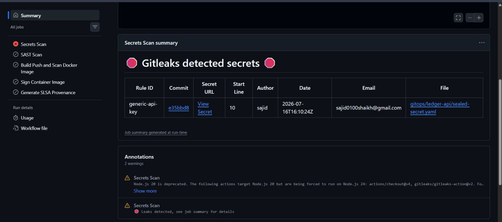

After adding `.gitleaks.toml` with a scoped allowlist entry for the
SealedSecret path, the same scan passes cleanly:

`gitops/evidence/02-gitleaks-no-leaks-after-fix.png`
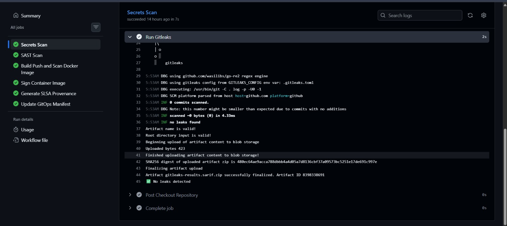

### Full pipeline run — all gates green

Complete run showing Secrets Scan → SAST → Build/Scan → Sign → SLSA →
GitOps update, all succeeded end to end (1m 50s total).

`gitops/evidence/03-full-pipeline-run-success.png`
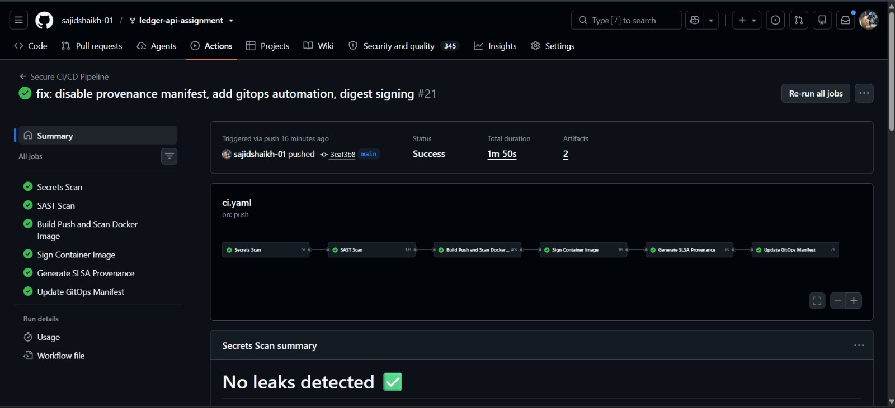

### SAST — Semgrep genuinely caught the SSRF finding

Semgrep detected 3 blocking findings, including the SSRF issue documented
in [`app/SECURITY-FIXES.md`](../app/SECURITY-FIXES.md), by rule:
`python.django.security.injection.ssrf.ssrf-injection-requests.ssrf-inject`.
This confirms the SAST gate found the vulnerability before manual review
did — direct evidence the fail-policy documentation's attribution is
accurate, not assumed.

`gitops/evidence/04-semgrep-ssrf-finding.png`
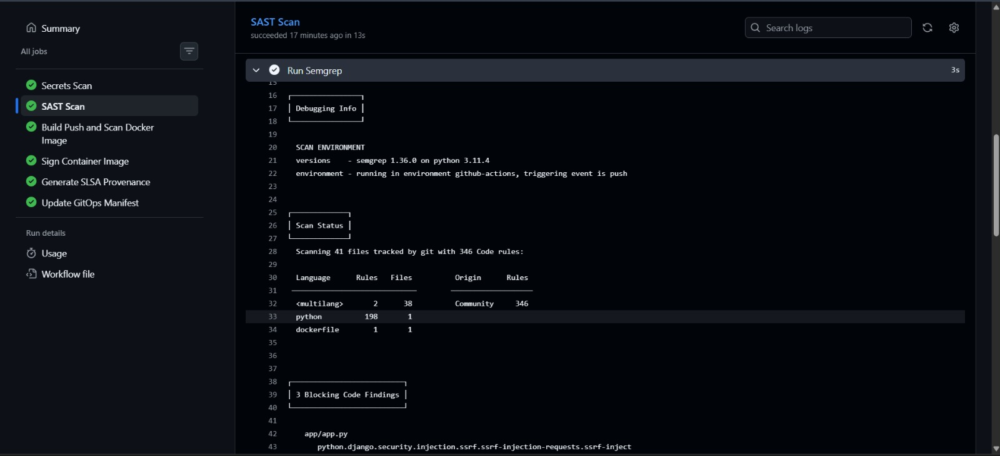

### Trivy image scan + SARIF upload

`gitops/evidence/05-trivy-scan-log.png`
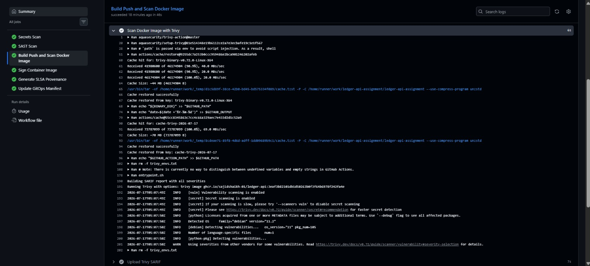

SARIF upload step and the "verify image is pullable" gate both succeeding
in the same job:

`gitops/evidence/06-trivy-sarif-upload-and-pull-verify.png`
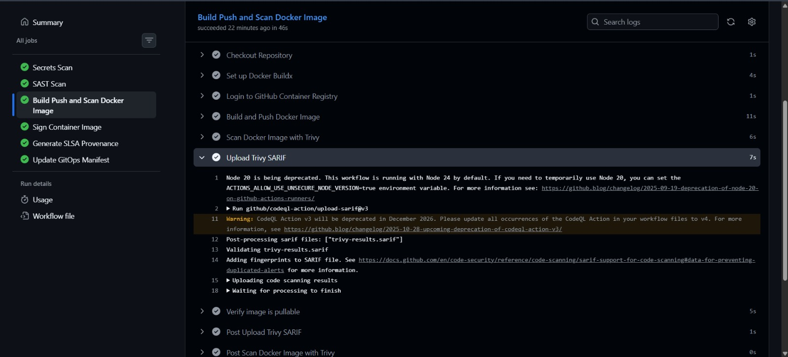

### Cosign keyless signing (by digest)

```
tlog entry created with index: 2188396876
Pushing signature to: ghcr.io/sajidshaikh-01/ledger-api
```

`gitops/evidence/07-cosign-sign-log.png`
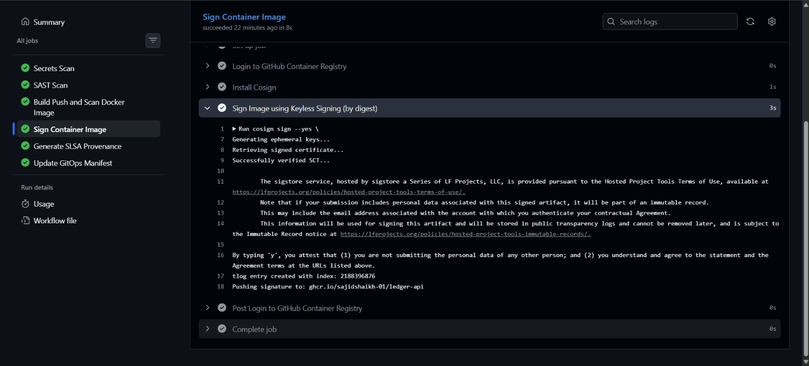

### SLSA provenance attestation

```
tlog entry created with index: 2188397895
```

`gitops/evidence/08-slsa-provenance-attest-log.png`
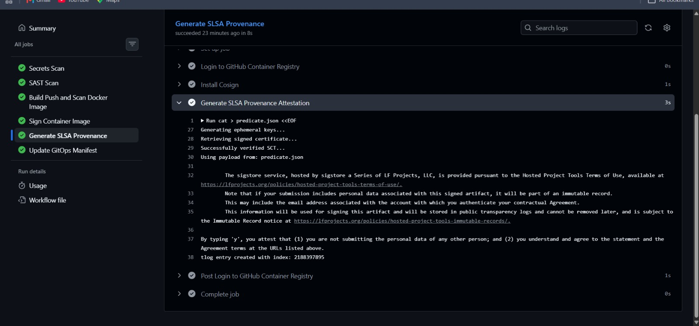

### GHCR — signed and attested artifacts published

Package page showing the image digest alongside its `.sig` and `.att`
artifacts, confirming the full sign + attest chain reached the registry.

`gitops/evidence/09-ghcr-signed-attested-tags.png`
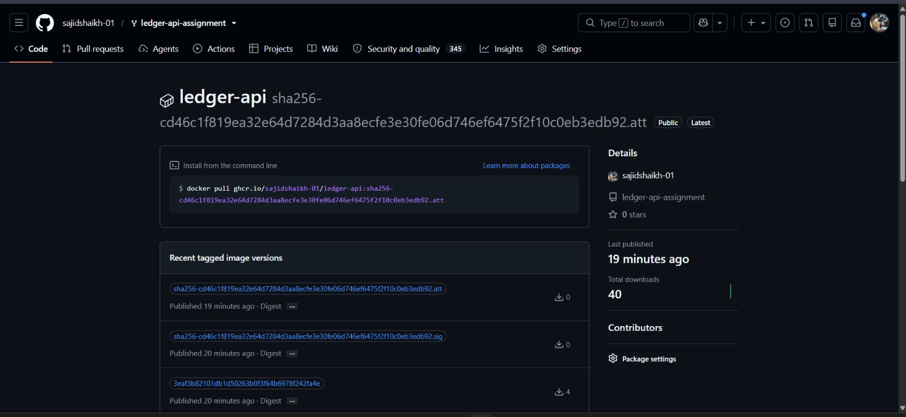

### GitOps manifest auto-update (CI → Git)

The `update-gitops-manifest` job rewriting the image tag and committing
back to `main` with `[skip ci]`, closing the loop from build to deploy
without any manual editing:

```
[main d1512b8] chore: bump ledger-api image to 3eaf3b82101db1d50263b0f3f64b6978f242fa4e [skip ci]
1 file changed, 1 insertion(+), 1 deletion(-)
```

`gitops/evidence/10-gitops-manifest-auto-commit.png`
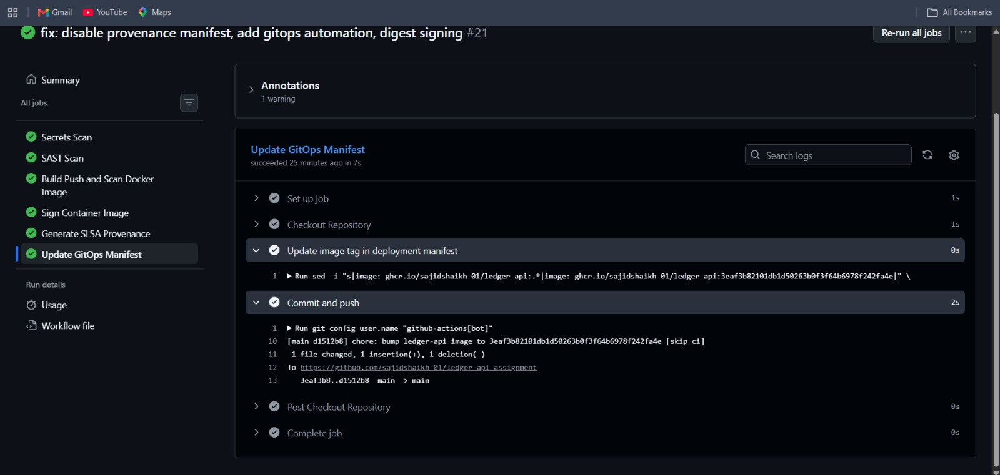

### ArgoCD — automated sync, Healthy, authored by the CI bot

Confirms ArgoCD picked up the bot's commit automatically (not a manual
sync) — `Author: github-actions[bot]`, all resources `Healthy`.

`gitops/evidence/11-argocd-healthy-automated-sync.png`
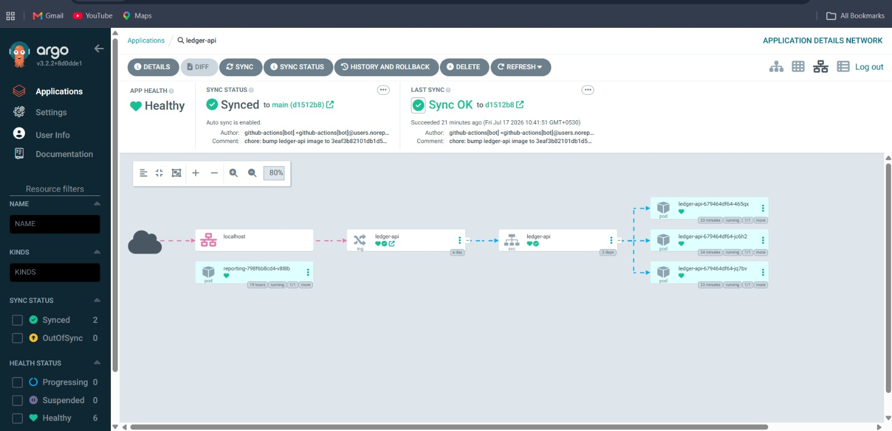

### Drift detection + self-heal

Terminal transcript of manually scaling to 5 replicas, ArgoCD detecting
drift (`OutOfSync`), and self-heal reverting back to Git's declared state
(3 replicas) within seconds:

`gitops/evidence/12-drift-detection-self-heal.png`
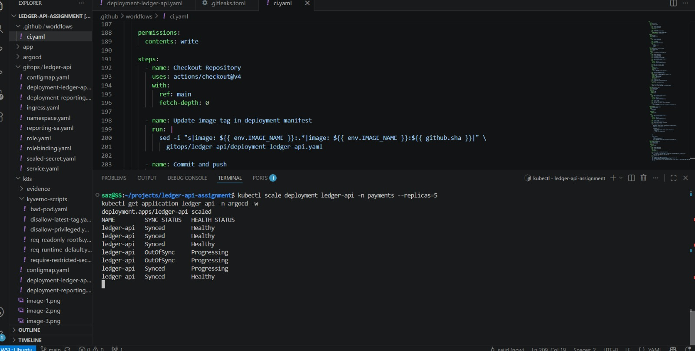

### Cosign verify (pending)

```bash
cosign verify \
  --certificate-identity-regexp "https://github.com/sajidshaikh-01/ledger-api-assignment/.*" \
  --certificate-oidc-issuer "https://token.actions.githubusercontent.com" \
  ghcr.io/sajidshaikh-01/ledger-api@<digest>
```

`gitops/evidence/13-cosign-verify-output.png` — *(still needed — run the
above and screenshot the result)*


