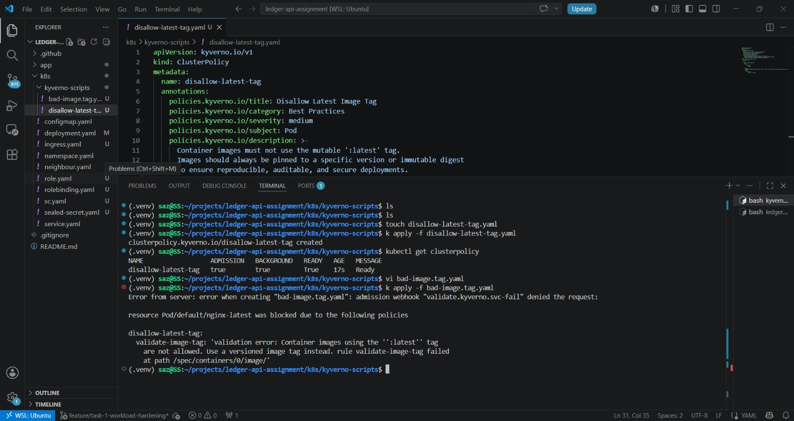
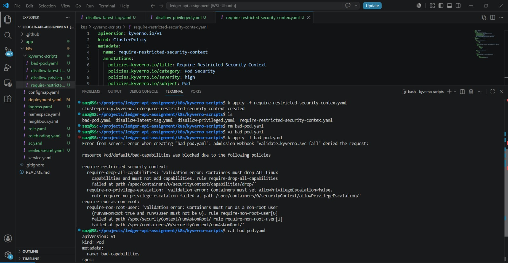
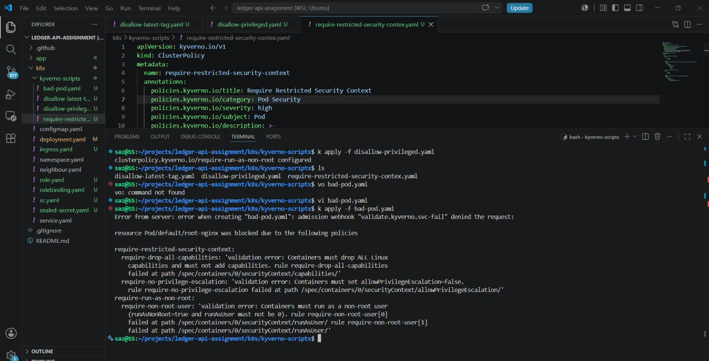
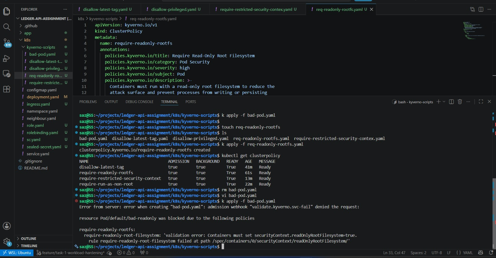
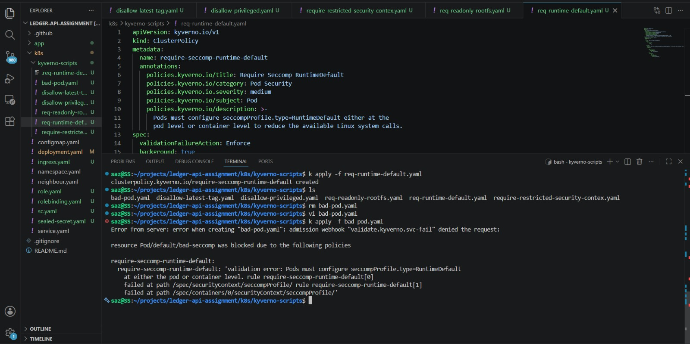
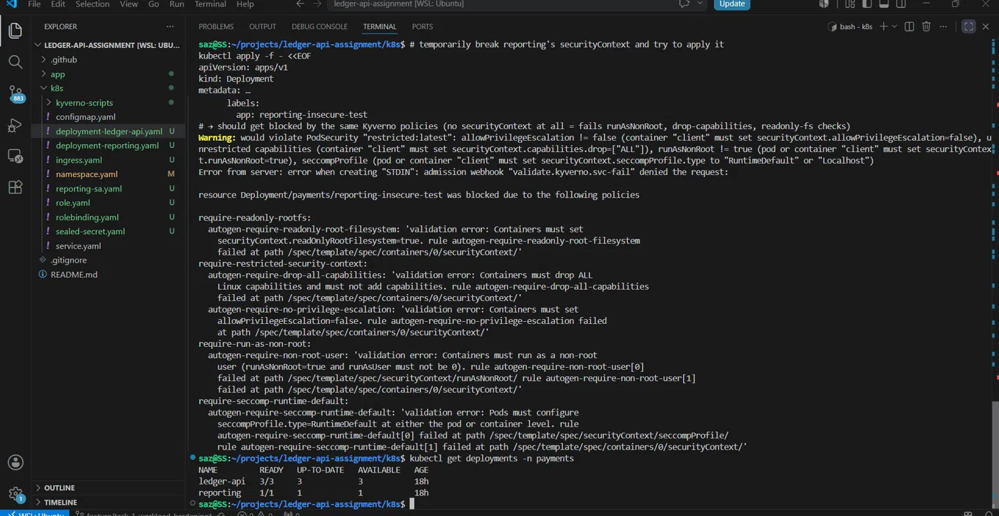

# Task 1 - Kubernetes Workload Hardening

## Overview

This task focuses on securing the Ledger API Kubernetes deployment by implementing Kubernetes security best practices. The objective was to harden workloads, protect sensitive configuration, enforce security policies, and apply the principle of least privilege throughout the deployment.

The following security controls were implemented:

- Namespace isolation
- Pod Security Admission (Restricted)
- Dedicated Service Accounts
- Least-Privilege RBAC
- ConfigMaps for application configuration
- Sealed Secrets for secret management
- Hardened container security context
- Kyverno admission policies
- Resource requests and limits
- Readiness and Liveness probes
- NGINX Ingress

---

# Deployment Architecture

```text
                     Internet
                         │
                  NGINX Ingress
                         │
                  Service (ClusterIP)
                         │
          ┌──────────────┴──────────────┐
          │                             │
   Ledger API (3 Pods)            Reporting Pod
          │                             │
          └──────────────┬──────────────┘
                         │
               ConfigMap + Sealed Secret
                         │
                Dedicated Service Accounts
                         │
                  Least Privilege RBAC
                         │
              Kyverno Admission Policies
                         │
      Pod Security Admission (Restricted)
```

---

# Repository Structure

```text
k8s/
├── configmap.yaml
├── deployment-ledger-api.yaml
├── deployment-reporting.yaml
├── ingress.yaml
├── namespace.yaml
├── reporting-sa.yaml
├── role.yaml
├── rolebinding.yaml
├── sealed-secret.yaml
├── service.yaml
├── kyverno-scripts/
└── README.md
```

---

# Security Controls Implemented

## Namespace Isolation

A dedicated Kubernetes namespace named **payments** was created to isolate application resources.

Pod Security Admission was enabled using the Restricted profile.

- enforce: restricted
- audit: restricted
- warn: restricted

---

## Dedicated Service Accounts

Created separate Service Accounts for each workload.

- ledger-api-sa
- reporting-sa

Service account tokens are disabled wherever they are not required.

---

## Least Privilege RBAC

Implemented dedicated Roles and RoleBindings for each workload.

Resources created:

- ledger-api-role
- ledger-api-rolebinding
- reporting-role
- reporting-rolebinding

Both Roles intentionally contain **zero Kubernetes API permissions** because neither application requires direct access to the Kubernetes API. This follows the Principle of Least Privilege.

---

## Secret Management

Removed plaintext secrets from Deployment manifests.

Implemented:

- ConfigMap
- Sealed Secret

Application configuration is injected using Kubernetes resources.

```yaml
envFrom:
  - configMapRef:
      name: ledger-api-config
  - secretRef:
      name: ledger-api-secret
```

Sensitive values are stored only inside Sealed Secrets and never committed in plaintext.

---

## Container Hardening

The Ledger API and Reporting workloads were hardened using the following security controls.

- Non-root container execution
- Dedicated user and group IDs
- Read-only root filesystem
- Linux capabilities dropped
- Privilege escalation disabled
- RuntimeDefault seccomp profile

Applied settings include:

- runAsNonRoot: true
- allowPrivilegeEscalation: false
- readOnlyRootFilesystem: true
- capabilities.drop: ["ALL"]
- seccompProfile: RuntimeDefault

---

## Health Checks

Configured both Readiness and Liveness probes using the application health endpoint.

```text
/health
```

These probes improve application reliability and availability.

---

## Resource Management

CPU and Memory requests and limits were configured to improve scheduling, reliability and protect against resource exhaustion.

---

## Ingress

An NGINX Ingress resource exposes the Ledger API service inside the Kubernetes cluster.

---

# Kyverno Admission Policies

The following Kyverno policies were implemented.

| Policy | Status |
|----------|:------:|
| Disallow Latest Image Tag | ✅ |
| Require Restricted Security Context | ✅ |
| Require Run As Non-Root | ✅ |
| Require Read-Only Root Filesystem | ✅ |
| Require RuntimeDefault Seccomp | ✅ |

---

# Validation Performed

The following validation tests were successfully executed.

- Attempted deployment using `:latest` image tag → Rejected
- Attempted deployment without securityContext → Rejected
- Attempted deployment running as root → Rejected
- Attempted deployment without readOnlyRootFilesystem → Rejected
- Verified RuntimeDefault seccomp profile
- Verified dedicated Service Accounts
- Verified Least Privilege RBAC configuration

---

# Policy Validation

## Disallow Latest Image Tag



---

## Require Restricted Security Context



---

## Require Run As Non-Root



---

## Require Read-Only Root Filesystem



---

## Require RuntimeDefault Seccomp



---

## RBAC Validation



---

# Security Improvements

The Ledger API deployment now implements the following security controls.

- Namespace isolation
- Pod Security Admission (Restricted)
- Dedicated Service Accounts
- Least Privilege RBAC
- ConfigMaps for configuration
- Sealed Secrets for sensitive data
- Non-root containers
- Read-only root filesystem
- Linux capability dropping
- RuntimeDefault seccomp profile
- Resource requests and limits
- Readiness and Liveness probes
- NGINX Ingress
- Kyverno admission control policies

---

