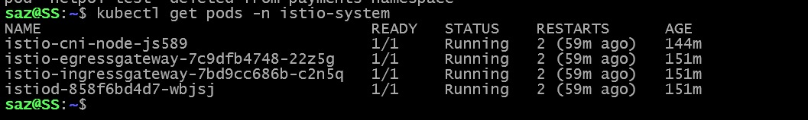
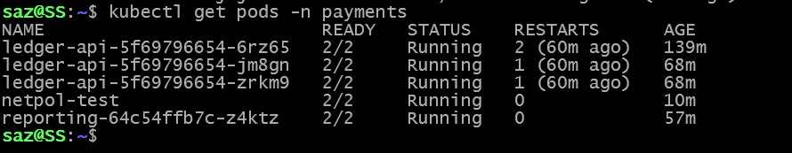
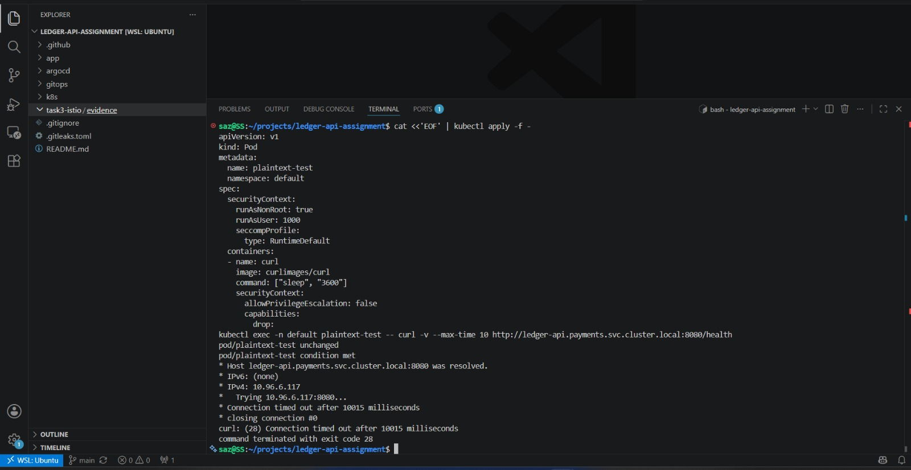
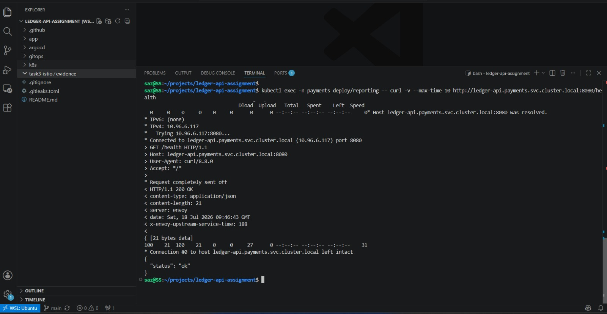
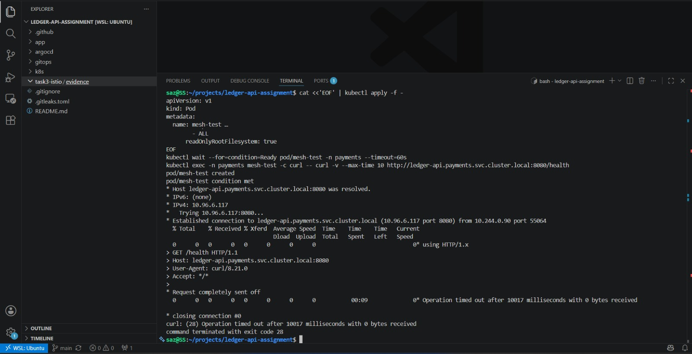
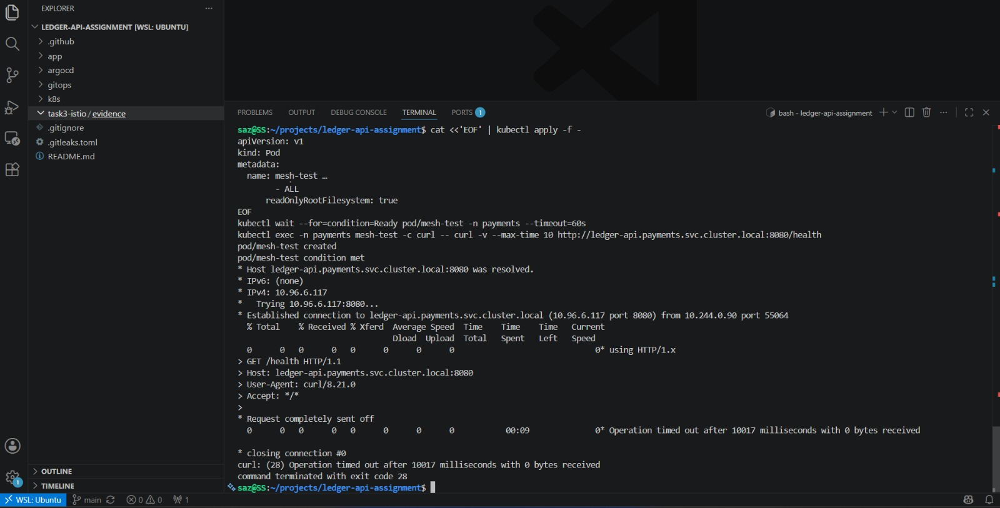
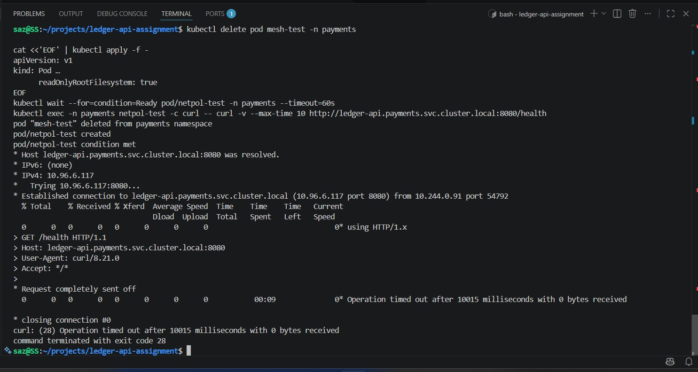

# Task 3 — Service Mesh & Zero-Trust (Istio)

This document covers bringing `ledger-api` and its neighbour service
(`reporting`) into an Istio service mesh, enforcing strict mTLS,
identity-based authorization, and a defense-in-depth NetworkPolicy layer
underneath — plus the real infrastructure conflicts hit along the way and
how they were resolved.

---

## 1. Architecture

Both `ledger-api` and `reporting` run with Istio sidecars injected via
namespace-level auto-injection (`istio-injection=enabled` on `payments`).
Traffic between them is protected by three independent, layered controls:

1. **PeerAuthentication** — mTLS STRICT (encryption + identity at the transport layer)
2. **AuthorizationPolicy** — default-deny + explicit allow, keyed on workload identity (SPIFFE/ServiceAccount)
3. **Kubernetes NetworkPolicy** — default-deny + explicit allow, at L3/L4 (IP/port), independent of the mesh

---

## 2. Installing Istio — infrastructure conflicts and how they were resolved

Istio was **not** a drop-in install here. The `payments`-hardening Kyverno
policies from Task 1 (`require-seccomp-runtime-default`,
`require-restricted-security-context`, `require-run-as-non-root`,
`disallow-latest-tag`) are cluster-wide `ClusterPolicy` resources, and they
correctly rejected Istio's own control-plane manifests, which don't ship
with the same hardening settings applied to their control-plane/infra
containers (they need elevated privileges to manage iptables and traffic
redirection at the node level).

**Decision:** rather than weakening these policies or disabling them
globally (which would undo Task 1's guardrails for the actual PCI-scoped
workload), each cluster-wide policy was patched to add an `exclude` block
scoping out `istio-system` and `kube-system` — infrastructure namespaces
outside the direct application workload — while leaving `payments` fully
enforced. `require-readonly-rootfs` didn't need this since it was already
scoped to `payments` only.

Even after that fix, Istio's `istio-init` container (default injection
mode) still required `NET_ADMIN`/`NET_RAW` capabilities and root to set up
per-pod traffic redirection — which directly conflicts with the
`restricted` Pod Security Standard enforced on `payments` from Task 1.
**Fix:** switched to Istio's **CNI plugin** mode
(`components.cni.enabled=true`), which moves traffic redirection into a
node-level DaemonSet (`istio-cni-node`, running in the excluded
`istio-system` namespace) instead of a privileged per-pod init container.
This means `ledger-api` and `reporting` pods run with zero privileged
containers, fully compliant with `restricted` PSS, while still getting
sidecar injection.

**Resource constraints:** installing Istio's control plane + ingress/egress
gateways + CNI DaemonSet on top of an already-running cluster (ArgoCD,
Kyverno, existing workloads) on a memory-constrained WSL2 environment
(3.5GB RAM) caused Kyverno's own pods to crash-loop under memory pressure
(`context deadline exceeded` errors talking to the API server). Fixed by
raising the WSL2 memory allocation via `.wslconfig` (`memory=5GB`,
`swap=2GB`) and removing the unused Istio egress gateway to reduce the
running footprint, since it isn't required by the assignment.

**Evidence:** `evidence/02-istio-installed-success.png`


---

## 3. Bringing workloads into the mesh

```bash
kubectl label namespace payments istio-injection=enabled
kubectl rollout restart deployment -n payments
```

Both `ledger-api` (3 replicas) and `reporting` came up `2/2 Running` —
confirming each pod now has its `istio-proxy` sidecar alongside the app
container.

**Evidence:** `evidence/03-sidecar-injection-2of2.png`


---

## 4. Layer 1 — mTLS STRICT (PeerAuthentication)

```yaml
apiVersion: security.istio.io/v1
kind: PeerAuthentication
metadata:
  name: default
  namespace: payments
spec:
  mtls:
    mode: STRICT
```

This forces every workload in `payments` to only accept mTLS-encrypted,
sidecar-to-sidecar traffic. Plaintext connections are refused before they
ever reach the application container.

**Proof — plaintext request refused:** a pod outside the mesh (`default`
namespace, no sidecar, no mTLS certificate) attempting a plain HTTP request
to `ledger-api` fails to complete the connection.

**Evidence:** `evidence/04-mtls-strict-plaintext-refused.png`


**Proof — mesh-to-mesh mTLS request succeeds:** a request from `reporting`
(which has a sidecar and a valid mesh-issued certificate) to `ledger-api`
completes normally over mTLS.

**Evidence:** `evidence/05-mtls-mesh-request-allowed.png`


---

## 5. Layer 2 — Identity-based AuthorizationPolicy

mTLS alone proves *encryption and identity*, but not *authorization* — any
workload with a valid mesh certificate could still reach `ledger-api`.
Explicit authorization is enforced on top, keyed on **workload identity
(SPIFFE / Kubernetes ServiceAccount)**, not IP address.

**Default-deny:**

```yaml
apiVersion: security.istio.io/v1
kind: AuthorizationPolicy
metadata:
  name: deny-all
  namespace: payments
spec: {}
```

An `AuthorizationPolicy` with an empty spec and no `action` denies all
traffic by default — nothing is allowed until explicitly permitted.

**Evidence:** `evidence/06-authz-default-deny-blocked.png`


**Explicit allow, by identity:**

```yaml
apiVersion: security.istio.io/v1
kind: AuthorizationPolicy
metadata:
  name: allow-reporting-to-ledger-api
  namespace: payments
spec:
  selector:
    matchLabels:
      app: ledger-api
  action: ALLOW
  rules:
  - from:
    - source:
        principals: ["cluster.local/ns/payments/sa/reporting-sa"]
    to:
    - operation:
        methods: ["GET"]
        paths: ["/health"]
```

This only allows requests presenting the `reporting-sa` ServiceAccount's
mTLS-issued identity — not requests from an arbitrary pod that happens to
share the `payments` namespace or IP range.

**Proof — unauthorised identity blocked:** a generic test pod in
`payments` (no matching ServiceAccount identity) is rejected with
`403 Forbidden` / `RBAC: access denied`, even though it's fully inside the
mesh with a valid mTLS cert.

**Evidence:** `evidence/07-authz-unauthorised-blocked.png`


**Proof — authorised identity allowed:** `reporting` (bearing the
`reporting-sa` identity) is allowed through and receives `200 OK`.

**Evidence:** `evidence/08-authz-authorised-allowed.png`


---

## 6. Layer 3 — Kubernetes NetworkPolicy (defense-in-depth)

Layered underneath Istio's L7/identity-aware controls is an L3/L4
Kubernetes-native NetworkPolicy, enforced independently of the mesh.

**Default-deny all ingress/egress in `payments`:**

```yaml
apiVersion: networking.k8s.io/v1
kind: NetworkPolicy
metadata:
  name: default-deny-all
  namespace: payments
spec:
  podSelector: {}
  policyTypes:
  - Ingress
  - Egress
```

**Explicit allows** were then added for exactly what each workload needs:
- `reporting` → `ledger-api` on port 8080 (ingress on `ledger-api`'s side,
  egress on `reporting`'s side — NetworkPolicy requires both, unlike
  AuthorizationPolicy which only needs a rule on the destination)
- All pods → kube-dns (UDP/TCP 53), required for any service name
  resolution to work at all
- All pods → `istiod` in `istio-system` (TCP 15012, 15010), required for
  certificate issuance/rotation
- `ledger-api` → external HTTPS/HTTP (80/443, excluding RFC1918 ranges),
  supporting its allowlisted `/fetch` endpoint

**Evidence:** `evidence/09-networkpolicy-allowed.png`


**Proof — NetworkPolicy blocks independently:** a pod with no matching
NetworkPolicy allowance (`app=netpol-test`) hangs and times out with **zero
bytes received** — a silent drop, distinct from Istio's explicit `403`.

**Evidence:** `evidence/10-networkpolicy-unauthorized-blocked.png`


---

## 7. What each layer catches that the other doesn't

| | Istio AuthorizationPolicy | Kubernetes NetworkPolicy |
|---|---|---|
| **Layer** | L7 (HTTP-aware) | L3/L4 (IP/port only) |
| **Identity model** | SPIFFE / ServiceAccount, cryptographically bound to mTLS cert | Pod labels / namespace selectors only — no cryptographic identity |
| **Granularity** | Can restrict by HTTP method, path, headers | Can only restrict by IP/port |
| **Failure mode** | Explicit `403 Forbidden` with reason | Silent packet drop / connection timeout |
| **Requires matching rule on** | Destination only | Both source (egress) and destination (ingress) |
| **Bypassed if** | Sidecar is compromised/disabled | Never — enforced by the CNI/kernel, independent of the app or sidecar |

Running both is intentional defense-in-depth: NetworkPolicy provides a
kernel-level backstop that holds even if a sidecar is misconfigured,
crashed, or bypassed, while AuthorizationPolicy provides much finer-grained,
identity-aware control that plain IP-based policy can't express.

---

## 8. Certificate issuance, rotation, and trust root

**How workload certificates are issued:**

When a pod's `istio-proxy` sidecar starts, it doesn't yet have a
certificate. The sidecar's local `istio-agent` generates a private key and
a Certificate Signing Request (CSR), then sends that CSR to **istiod** (the
mesh's control plane) over a channel authenticated using the pod's
Kubernetes **ServiceAccount token** — this is what proves the workload's
identity to istiod in the first place, before any certificate exists.

istiod validates that ServiceAccount token against the Kubernetes API
server, then signs the CSR and returns an X.509 certificate. That
certificate encodes the workload's identity as a **SPIFFE ID**, in this
format:


This is exactly why `AuthorizationPolicy` in this setup can key off
`principals: ["cluster.local/ns/payments/sa/reporting-sa"]` — the identity
being checked isn't an IP address or a Kubernetes label, it is
cryptographically bound into the certificate itself, issued by istiod, and
presented during the mTLS handshake.

**How rotation works:**

These workload certificates are short-lived by design — 24 hours by
default in Istio. Each pod's `istio-agent` continuously and automatically
requests a replacement certificate well before the current one expires.
There is no manual step and no connection downtime: the agent always has a
fresh certificate ready before the old one lapses, so in-flight mTLS
connections are never interrupted by rotation.

**What the trust root is:**

istiod itself acts as the mesh's built-in Certificate Authority (CA). By
default, at cluster bring-up, istiod self-signs its own root CA
certificate (stored in the `istio-ca-secret` in the `istio-system`
namespace). Every workload certificate that istiod issues is signed by
that same root, which is exactly why sidecar-to-sidecar mTLS handshakes
succeed automatically across the mesh — every sidecar already trusts
certificates signed by istiod's root, with no manual certificate
distribution required.

In a real production/PCI environment, this self-signed root would
typically **not** be used directly. Instead, istiod would be configured as
an **intermediate CA**, chained up to the organization's existing root CA
(via the `cacerts` secret in `istio-system`). This way, the mesh's trust
root ties back into the organization's broader PKI and certificate
lifecycle management, rather than being an isolated, mesh-local island of
trust that auditors would need to evaluate separately.

---

## 9. Commands reference

```bash
# Install Istio (CNI mode, after Kyverno namespace exclusions applied)
istioctl install -f - -y <<'EOF'
apiVersion: install.istio.io/v1alpha1
kind: IstioOperator
spec:
  profile: demo
  components:
    cni:
      enabled: true
  values:
    cni:
      privileged: true
EOF

# Enable sidecar injection + restart workloads
kubectl label namespace payments istio-injection=enabled
kubectl rollout restart deployment -n payments

# mTLS STRICT
kubectl apply -f peer-authentication.yaml

# Default-deny + identity-based allow
kubectl apply -f authorization-policy.yaml

# NetworkPolicy defense-in-depth
kubectl apply -f network-policy.yaml
```

Full manifests are included in this folder alongside this README.